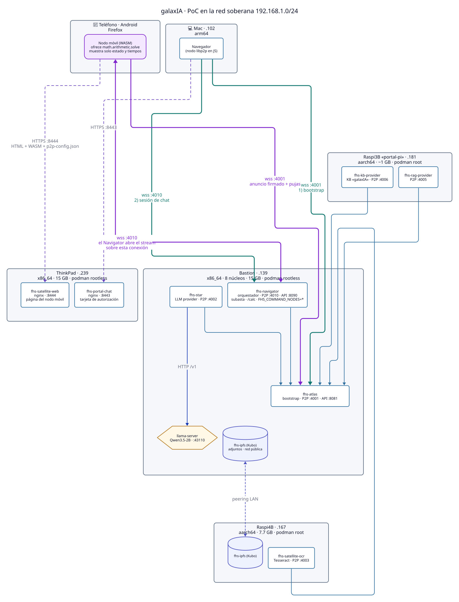
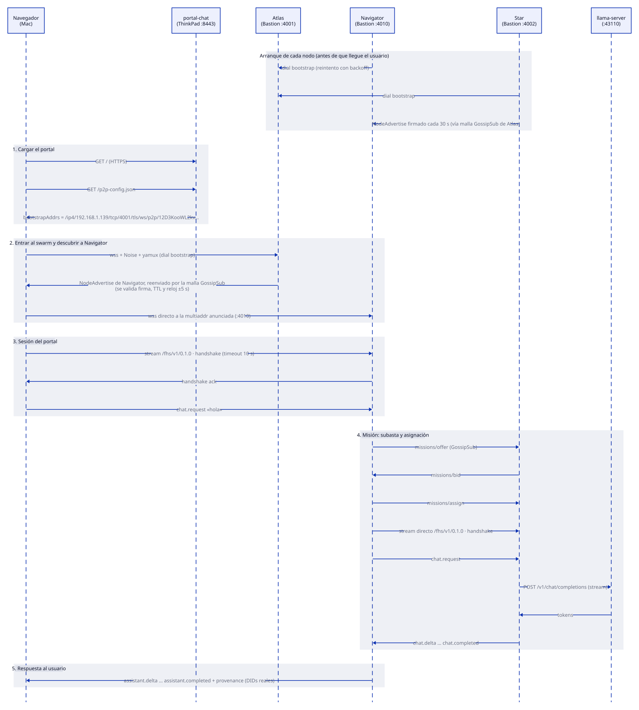
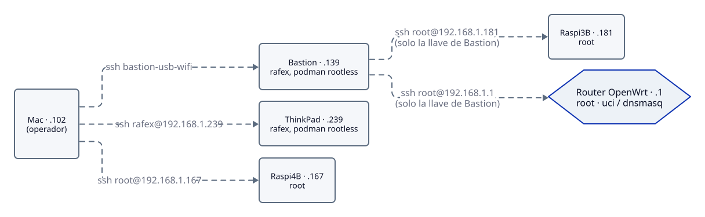
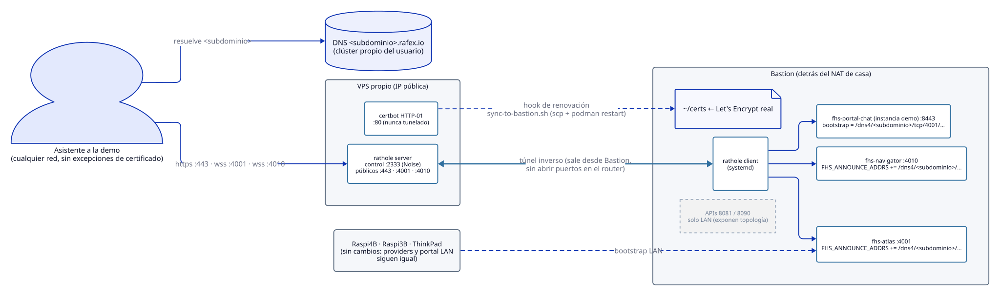

# Arquitectura de la PoC

Laboratorio físico donde galaxIA corre de punta a punta: un chat que responde
un LLM local, más OCR, RAG y base de conocimiento, repartidos en hardware
modesto y conectados **solo por P2P** (FHS sobre libp2p), sin un servidor
central que enrute los mensajes.

Este documento describe **cómo está armado y por qué**. El estado del día
(qué está arriba, qué versión corre, qué falla) vive aparte en
[`estado-poc.md`](estado-poc.md).

Mapa de módulos (repo, lenguaje y versión, acoplamiento, máquina e IP):
[`mapa-modulos.md`](mapa-modulos.md).

Los diagramas están escritos en [D2](https://d2lang.com/). Las fuentes están
en [`diagramas/`](diagramas/) y los SVG se regeneran con
`scripts/render-diagramas.sh`.

## Hardware

Cinco equipos en la **red soberana `192.168.1.0/24`**, detrás de un router
OpenWrt 25.12 (`192.168.1.1`). Cada equipo tiene una **reserva DHCP fija**,
porque las IPs están grabadas en el SAN del certificado y en las multiaddrs
anunciadas: si una IP cambia, se rompe TLS.

| Equipo | IP | Arquitectura / recursos | Runtime | Rol |
|---|---|---|---|---|
| **Bastion** | `.139` | x86_64 · 8 núcleos · 15 GB | podman 5.4 rootless (linger) | Atlas, Navigator, Star y `llama-server` |
| **Raspi4B** | `.167` | aarch64 · 7.7 GB | podman 5.4 root | Satellite OCR (Tesseract) |
| **Raspi3B «portal-pi»** | `.181` | aarch64 · **~1 GB** | podman 5.4 root | KB provider y RAG provider |
| **ThinkPad** | `.239` | x86_64 · 4 núcleos · 15 GB | podman 5.8 rootless | Portal Chat (el frontend) |
| **Mac** | `.102` | arm64 | — | Navegador del operador y de la demo |

## Qué corre dónde

| Contenedor | Host | Imagen base | P2P (wss) | API / web | Estado persistente |
|---|---|---|---|---|---|
| `fhs-atlas` | Bastion | `node:24-alpine` | `:4001` | `:8081` `/health`, `/status` | volumen `atlas-data` (identidad; PeerID fijo `12D3KooWL2kv…`) |
| `fhs-navigator` | Bastion | `node:24-alpine` | `:4010` | `:8090` `/health`, `/status` | volumen `navigator-data` (identidad) |
| `fhs-star` | Bastion | `node:24-alpine` | `:4002` | — | volumen `star-data` (identidad) |
| `llama-server` | Bastion (host, `systemd --user`) | llama.cpp compilado con [PoC-Llama.cpp](https://github.com/rafex/PoC-Llama.cpp) (perfil `apple/macmini6.2`: AVX+F16C, sin BLAS) | — | `:43110` `/v1` (qwen2.5-3b-instruct Q4_K_M) | modelos en `/srv/models/gguf` |
| `fhs-satellite-ocr` | Raspi4B | `node:24-bookworm`¹ | `:4003` | — | volumen `ocr-data` |
| `fhs-kb-provider` | Raspi3B | `node:24-alpine` | `:4006` | — | volumen `kb-data` |
| `fhs-rag-provider` | Raspi3B | `node:24-alpine` | `:4005` | — | volumen `rag-data` |
| `fhs-portal-chat` | ThinkPad | `nginx:alpine` | — | `:8443` HTTPS (`p2p-config.json`); único con `-p` en vez de red host | `~/certs/portal-chat` |

¹ OCR usa Debian porque Tesseract (`tesseract-ocr-spa`, `poppler-utils`) no
tiene paquetes Alpine estables.

Las imágenes se construyen **en cada host, en su propia arquitectura**, con
`containers/build-images.sh` de `galaxIA-Core` y de `galaxIA-satellite-star`.
En la Raspi3B se construyen una por una, porque con 1 GB no caben dos builds
a la vez. Ver `galaxIA-Core/docs/distribucion-imagenes.md`.

## Cómo fluye un mensaje

El punto clave: **el navegador es un nodo libp2p más**. El portal solo sirve
HTML y la dirección del bootstrap. Todo lo demás es P2P desde el navegador:

1. **Carga:** el navegador baja el portal y `p2p-config.json`, que trae la
   multiaddr de Atlas.
2. **Swarm:** se conecta a Atlas (`wss://…:4001`), se suscribe a
   `fhs/v1/nodes/advertise` y espera el `NodeAdvertise` firmado de
   Navigator. El anuncio se descarta si la firma no cuadra, si venció el TTL
   o si el reloj está desfasado más de 5 s.
3. **Sesión:** marca **directo** a la multiaddr anunciada de Navigator
   (`wss://…:4010`), abre el stream `/fhs/v1/0.1.0` y hace el handshake,
   que tiene 10 s de límite.
4. **Misión:** Navigator publica una oferta (`missions/offer`), los providers
   pujan (`missions/bid`), Navigator asigna (`missions/assign`) y abre un
   stream directo al ganador. Star llama a `llama-server` y devuelve
   `chat.delta` y `chat.completed`.
5. **Respuesta:** Navigator reenvía los deltas al navegador con la
   `provenance`, que lleva los DIDs reales de quien respondió.

Por eso **el navegador necesita alcanzar dos puertos de Bastion** (`4001` y
`4010`), no solo el portal. Cada uno necesita un certificado que el
navegador acepte.

### Stack P2P

| Capa | Elección |
|---|---|
| Transporte | WebSocket seguro (`/tls/ws`), el único que un navegador puede marcar |
| Cifrado de sesión | Noise |
| Multiplexación | yamux |
| Descubrimiento | Kademlia DHT (beacons) + GossipSub `fhs/v1/nodes/advertise` |
| Mercado de misiones | GossipSub `fhs/v1/missions/{offer,bid,assign}` |
| Identidad | Ed25519: la misma llave da el PeerID de libp2p y el `did:key` |

## Decisiones operativas (y por qué)

- **`--network host` en todos los contenedores P2P.** Con podman rootless,
  un contenedor no alcanzaba a Atlas en el mismo host por su IP de LAN (hairpin
  NAT). Ver `E2E-023` en `galaxIA-Core/docs/historial-incidencias-e2e.md`.
- **`--restart always` + `podman-restart.service` + `loginctl enable-linger`.**
  Con `unless-stopped`, nada volvía después de reiniciar. `podman-restart`
  solo arranca contenedores con política `always` (`E2E-024`).
- **Reconexión al bootstrap.** Los nodos reintentan con backoff hasta
  alcanzar a Atlas y **vuelven a marcar si se cae la conexión**
  (`dialBootstraps` en `fhs-node` y `fhs-wire`). Sin esto, un nodo que
  arranca antes que Atlas, o que lo pierde cuando Atlas se reinicia, queda
  aislado sin avisar.
- **Un solo certificado autofirmado** para Bastion y las Raspis
  (`~/certs/{dev,e2e}.{crt,key}`). Su SAN cubre `localhost`, `127.0.0.1`,
  `.139`, `.167`, `.181` y las IPs Netup de Bastion (`192.168.3.175` y
  `.143`). El portal genera su propio certificado para `.239`.
- **Bastion es el puente de operación:** la Raspi3B y el router solo
  aceptan la llave de Bastion.

  

## Puntos únicos de falla

- **Bastion.** Concentra el bootstrap (Atlas), el orquestador (Navigator),
  el único LLM (Star + `llama-server`) y el acceso SSH a la Raspi3B. Si se
  apaga, no hay chat. Sí se probó que **vuelve solo** después de un
  reinicio.
- **RAM de la Raspi3B.** Dos procesos Node con libp2p en ~1 GB: funciona
  (~780 MB libres con ambos arriba), pero no aguanta un build en paralelo.
- **Certificados autofirmados.** Cada navegador nuevo tiene que aceptar la
  excepción en `:4001` y en `:4010`, además de la del portal. En la demo
  remota se resuelve con Let's Encrypt (ver abajo).

## Observabilidad

| Dónde | Qué da |
|---|---|
| `scripts/doctor.sh <portal>` | Desde cualquier máquina: portal, bootstrap y Navigator (TCP, TLS, SAN, vencimiento), reloj, peers en Atlas y providers en Navigator. Salida ✅/⚠️/❌ con una pista por fila |
| Portal → botón 🩺 | En qué etapa se quedó la conexión, cada `wss://` con ✓/✗, el enlace para aceptar el certificado y un botón "Copiar diagnóstico" |
| Atlas `:8081/status` | `peerCount`, conexiones (dirección remota y antigüedad) y malla GossipSub por tema |
| Navigator `:8090/health`, `/status` | DID, multiaddrs anunciadas, conexiones y providers conocidos (`knownPeers`) |
| Logs de cada contenedor | Intentos de bootstrap y reconexión, `connection:open/close`, frames descartados y errores de libp2p (`DEBUG=libp2p:*:error`) |

Detalle en `galaxIA-Core/docs/diagnostico.md`.

## Demo remota: cómo se espera que funcione

Todavía **no está desplegada**. Faltan el subdominio y el acceso al VPS.
Para mostrar la PoC desde otra ciudad sin mover el hardware, un VPS propio
con `rathole` recibe el tráfico público y lo manda por un túnel inverso a
Bastion. Let's Encrypt quita las excepciones de certificado.

- Solo se tunelan `443` (portal), `4001` (Atlas) y `4010` (Navigator). Las
  APIs `8081` y `8090` se quedan en la LAN porque exponen la topología.
- Atlas y Navigator agregan la ruta pública a `FHS_ANNOUNCE_ADDRS` sin quitar
  las de la LAN.
- El portal de la demo es **una segunda instancia en Bastion**, con el
  bootstrap público `/dns4/<subdominio>/…`. El túnel apunta a
  `127.0.0.1:8443` de Bastion. El portal de la ThinkPad sigue sirviendo a
  la LAN sin cambios.

Diseño completo y pasos: [`acceso-remoto-demo.md`](acceso-remoto-demo.md).
