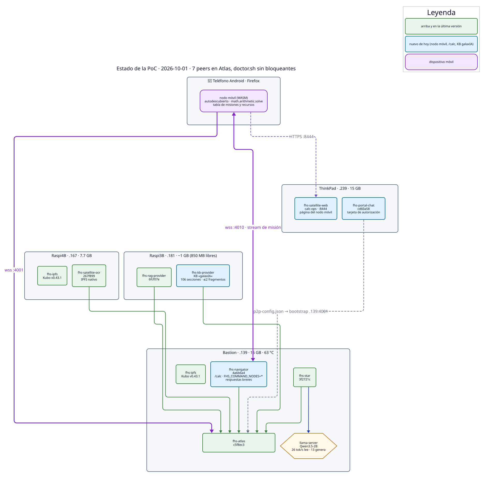
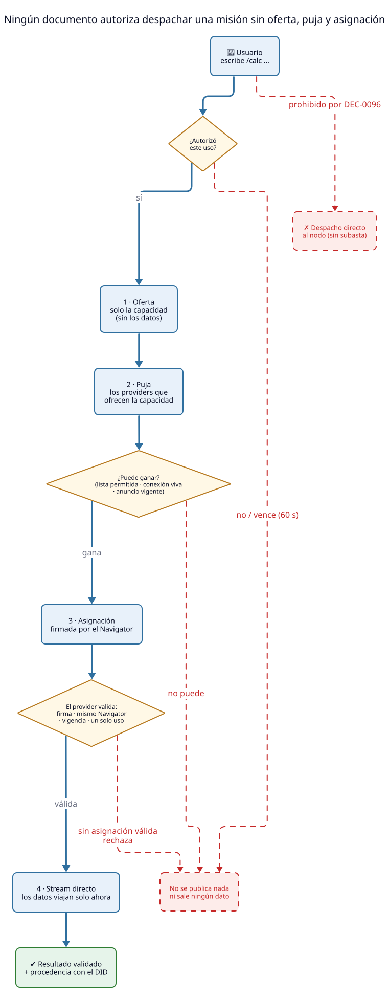

# Estado de la PoC

> **Snapshot: 2026-10-01 15:40 (CST).** Se actualiza a mano. Cada dato sale
> de un comando corrido en ese momento (`podman ps/inspect`, `/status`,
> `/health`, `llama-bench`, `doctor.sh`); no se copia de la memoria.
> Arquitectura y porqués: [`arquitectura-poc.md`](arquitectura-poc.md).
> Runbook del nodo móvil: [`nodo-movil-calc.md`](nodo-movil-calc.md).

## En una línea

**Un teléfono se une solo a la red y presta su cómputo.** Desde el Portal,
`/calc` pide autorización expresa, el Navigator despacha con oferta, puja y
asignación (DEC-0096) y el resultado vuelve con la procedencia del teléfono.
Todo el backend corre en Rust; Atlas ve **7 peers** (5 nodos, el teléfono y
el navegador), Navigator conoce a 1 star y 4 satellites y `doctor.sh` sale
sin problemas bloqueantes. Los contenedores TS y las versiones anteriores
quedaron detenidos como reversa (`*-ts-rollback`, `*-pre-<commit>`).



## Qué cambió el 2026-10-02

| Novedad | Detalle |
|---|---|
| **Comandos autodescubiertos** (SPEC-CMD-0001, DEC-0100) | El Navigator no tiene `/calc` cableado: el teléfono declara su comando en el anuncio firmado; el Navigator lo admite según el registro cerrado y `FHS_COMMAND_NODES`. `/ayuda` es local y un `/nombre` desconocido (p. ej. `/leer`) se responde sin pasar por el LLM. Portal con autocompletado. Verificado en el laboratorio con un nodo móvil headless (huella del contrato y digest idénticos a los de los fixtures) |
| **Frescura del anuncio** | Reloj ±120 s, TTL 1–120 s, `timestamp` estrictamente creciente por DID; la vida de un nodo sale del anuncio, no de la recepción |
| **Autorización por uso** | Desplegada el 2026-10-01 (SPEC-AUTHZ-0001): OCR, IPFS, RAG, KB, comandos y herramientas del LLM piden su propia tarjeta |

Imágenes del 2026-10-02: Atlas `galaxia-atlas-rs:cmd-aeb82f6` (reversa `fhs-atlas-pre-cmd`), Navigator
`galaxia-agent:6785fbe` (reversa `fhs-navigator-pre-6785fbe`), página del nodo móvil
`galaxia-satellite-web:cmd-6b24438` (reversa `fhs-satellite-web-pre-cmd`) y Portal
`galaxia-portal-chat:cmd-aeb82f6` (reversa `fhs-portal-chat-pre-cmd`). Hasta que el teléfono recargue la
página, no declara comandos (`fhs_version` 0.2).

## Qué cambió el 2026-10-01

| Novedad | Detalle |
|---|---|
| **Nodo móvil** (DEC-0097) | Página servida desde la ThinkPad (`:8444`); el navegador del teléfono es un nodo libp2p que se anuncia con `math.arithmetic.solve`, puja y ejecuta en WASM. Autodescubierto: el Navigator corre con `FHS_COMMAND_NODES=*` |
| **Regla de despacho** (DEC-0096) | Ninguna misión sin oferta, puja y asignación; el provider móvil rechaza lo que no tenga asignación válida (firma, mismo Navigator, vigencia, un solo uso) |
| **Autorización por uso** | `/calc` muestra una tarjeta con el nodo y qué se enviará; "Rechazar" o vencer (60 s) no publica nada. OCR, RAG y KB aún no la piden |
| **Datos operativos en el teléfono** | Tabla de misiones (estado y tiempos) y recursos del dispositivo; nunca la expresión ni el resultado |
| **KB «galaxIA»** | 11 documentos públicos en 106 secciones por encabezado, citadas como `archivo › sección`; BM25 y como máximo 2 fragmentos por consulta. Se crea soltando `.md` en una carpeta (`examples/kb-provider/scripts/build-galaxia-kb.sh`) |
| **Respuestas breves** | El Navigator pide un máximo de 5 oraciones: el prompt se lee a ~26 tok/s en Bastion y cada palabra extra se paga en segundos |



## Por equipo

| Equipo | Contenedores | Código desplegado | Nota |
|---|---|---|---|
| Bastion `.139` | `fhs-atlas` | Core `aeb82f6` (`rust/atlas`) | Mismo PeerId; reenvía los anuncios vigentes a cada suscriptor nuevo. Reversa: `fhs-atlas-pre-cmd` |
| | `fhs-navigator` | galaxIA-agent `6785fbe` | Comandos autodescubiertos (`FHS_COMMAND_NODES=*`), autorización por uso, respuestas breves. IPFS con libro de pines en `/data/ipfs-pins.json`. Reversa: `fhs-navigator-pre-6785fbe` |
| | `fhs-ipfs` | Kubo `v0.43.1` | Red pública, swarm `4101`, API en loopback con tokens |
| | `fhs-star` | satellite-star `3f2721c` (`rust/star`) | `MODEL_ID=Qwen3.5-2B-Q4_K_M` |
| | `llama-server` (`systemd --user`) | llama.cpp `7fe450e` | **Qwen3.5-2B** Q4_K_M, `--reasoning off`, 4 hilos: ~26 tok/s leyendo el prompt y ~13 generando (`llama-bench`). 63 °C |
| Raspi4B `.167` | `fhs-satellite-ocr` | satellite-star `267f899` (`rust/ocr`) | Tesseract 5.3 `spa`; lee IPFS por su Kubo y anuncia `ipfs.native.public` |
| | `fhs-ipfs` | Kubo `v0.43.1` | Peering a Bastion por la LAN. Esta máquina también compila las imágenes aarch64 |
| Raspi3B `.181` | `fhs-kb-provider` | satellite-star `b0fa7e2` (`rust/kb`) | KB «galaxIA»: corpus montado como volumen `/root/kb-galaxia:/app/content`, 106 secciones. Reversa: `fhs-kb-provider-pre-61eb9f5` (Constitución de ejemplo) |
| | `fhs-rag-provider` | satellite-star `6fcf07e` (`rust/rag`) | ~850 MB libres en la máquina |
| ThinkPad `.239` | `fhs-portal-chat` | Core `cd60a58` | Tarjeta de autorización de comandos. Reversa: `fhs-portal-chat-pre-cd60a58` |
| | `fhs-satellite-web` | SDK `a3820ba` (imagen `calc-ops`) | Página del nodo móvil en `:8444`, con CSP y certificado propio (SAN `.239`) |
| Teléfono Android | Firefox | misma página | Conectado a Atlas y al Navigator; anunciado con `math.arithmetic.solve` |

### `doctor.sh` desde el Mac

```
EXPECTED_PEERS=6 scripts/doctor.sh https://192.168.1.239:8443
```

Sin bloqueantes: portal, reloj (desfase 0 s), `p2p-config.json`, Atlas
`:4001`, **7 peers en Atlas** (5 nodos + teléfono + navegador), Navigator
`:4010`, 1 star + 4 satellites anunciados. Las 4 advertencias son las
excepciones de certificado autofirmado, esperadas en la LAN.

### Elección del modelo (batería del 2026-10-01)

Ocho modelos ya descargados, mismas tareas que hace la PoC (datos en
español, respuesta con base en fragmentos de KB, frase de confirmación de
`/calc` sin cifras nuevas, y selección de KB en JSON); una corrida por
modelo, temperatura 0, binario con AVX y 4 hilos. Muestra chica: 3–4
preguntas por categoría.

| Modelo | MB | Lee (tok/s) | Genera (tok/s) | Datos | KB | Confirmación | JSON |
|---|---|---|---|---|---|---|---|
| **Qwen3.5-2B** (oficial) | 1,221 | 26 | 13 | 4/4 | 4/4 | 4/4 | 2/3 |
| qwen2.5-3b | 2,007 | 16 | 10 | 4/4 | 4/4 | 4/4 | **3/3** |
| Llama-3.2-3B | 1,925 | 16 | 9 | 4/4 | 4/4 | 4/4 | 2/3 |
| qwen2.5-1.5b | 1,065 | 33 | 19 | 4/4 | 3/4 | 4/4 | 1/3 |
| LFM2-1.2B | 697 | 44 | 27 | 4/4 | 3/4 | 4/4 | 1/3 |
| smollm2-1.7b | 1,006 | 28 | 15 | 4/4 | 2/4 | 4/4 | 0/3 |
| Qwen3.5-0.8B | 507 | 62 | 27 | 3/4 | 4/4 | 4/4 | 2/3 |
| Llama-3.2-1B | 770 | 47 | 23 | 3/4 | 1/4 | 4/4 | 1/3 |

Se mantiene Qwen3.5-2B: casi perfecto, el doble de rápido leyendo el prompt
que los de 3 B y ya validado de punta a punta. `qwen2.5-3b` queda como
respaldo de calidad. Más hilos no ayudan a leer el prompt (4 → 8 hilos:
26.6 → 28.9 tok/s): el límite es el CPU.

**Latencia medida con la KB (2026-10-01):** una pregunta con KB tarda **~38–44 s**
de punta a punta (primer texto a los 20–24 s; el resto es generar ~460 caracteres a
13 tok/s). Casi todo es leer el prompt (~26 tok/s). Por eso las secciones son
cortas, la KB devuelve como máximo 2 fragmentos y el Navigator pide respuestas
breves. Se probó usar los fragmentos de la KB directamente, sin la fusión por RAG,
cuando hay una sola KB: no ahorró tiempo (primer texto a los 20 s) y la respuesta
inventó datos, así que se revirtió. Para bajar de ahí hace falta un modelo más
rápido o menos contexto, a costa de calidad.

## Historial · 2026-09-27: qué cambió y por qué

| Problema | Causa | Arreglo |
|---|---|---|
| Chat "reintentando" con red 5/5 y certificados aceptados | El portal cerraba la conexión con Navigator que acababa de elegir (libp2p reutiliza la conexión existente) — E2E-026 | Portal `464a178` |
| Un prompt tardaba >5 min | El `start-server.sh` instalado pasaba el batch como `-tb 512`: 512 hilos en 8 núcleos | Wrappers regenerados (`make post-install`) |
| Generación a 1.8 tok/s con el 3B | Perfil Ivy Bridge compilado sin AVX/F16C (SSE4.2 puro) | PoC-Llama.cpp `8051c41` (ADR-007): 10.4 tok/s con el mismo 3B |
| Respuesta completa antes de ver texto | Star bufferizaba la salida de `curl` | Star `7d7c0bf`: `fetch` con streaming, plazos por fase, mensajes OpenAI sin `$typeName` |
| OCR fuera de la red (4/5) | Imagen vieja sin reconexión al bootstrap | Recreado con `ebf0299` |
| Adjuntar un PDF fallaba: `[object ErrorEvent]` | Navigator marcaba solo la primera multiaddr del provider (`127.0.0.1`, que desde Bastion es Bastion) — E2E-027 | Navigator `c63fc3d`: prueba todas, loopback al final; errores legibles |
| La KB no se consultaba ("artículo 3 sobre la educación") | Recomendación por Jaccard sobre palabras crudas: puntaje 0 contra "Constitución Política…" | Navigator `54fb599` (cobertura sin acentos ni palabras vacías) + descripción de la KB ampliada |
| Respuestas en texto plano, sin copiar | El portal ponía la respuesta con `textContent` | Portal `c74ef5d`: Markdown armado nodo por nodo (sin `innerHTML`), botón "Copiar" |
| Se probó Qwen3.5-0.8B por velocidad | 62 tok/s leyendo prompt y 27.6 generando, pero inventa datos básicos | Vuelta a qwen2.5-3b (ver "Elección del modelo") |

### Elección del modelo

Misma batería de preguntas en español (hora, autor, capital, año de la Luna,
artículo 3), binario con AVX, 4 hilos:

| Modelo | tok/s | Datos correctos (de 4) |
|---|---|---|
| Qwen3-0.6B | 42 | 1 ("Rogerswell", "Sydney") |
| Qwen3.5-0.8B | 27 | 1 ("Sydney", "2012") |
| qwen2.5-1.5b-instruct | 20 | 3 (falla el artículo 3) |
| qwen2.5-3b-instruct | 10.6 | **4** |
| **Qwen3.5-2B** (oficial desde 2026-09-27, decisión del dueño) | ~14 | 2 ("Sídney"; el artículo 3 lo confunde con el 39). Con la KB sí responde bien el artículo 3: pasa la prueba e2e (KB, OCR, RAG) |

- **Ninguno sabe la hora**: todos la inventan (no hay herramienta que la dé).
- Qwen3.x **piensa por defecto**: sin `--reasoning off` gastaba todo
  `max_tokens` razonando y respondía vacío. El servicio mantiene la opción
  por si se vuelve a un Qwen3.x.

## Problemas conocidos (sin resolver)

- **El beacon en la DHT nunca se publica a tiempo** (Navigator, Star y los
  providers terminan en timeout). No bloquea: el descubrimiento por GossipSub
  funciona.
- **Navigator ignora SIGTERM**: `podman stop` espera 10 s y lo mata (visto
  otra vez al recrearlo hoy).
- **La compilación de `galaxia-portal-chat` en Bastion se colgó** ~20 min en
  `npm install` sin consumir CPU. No hacía falta ahí (el portal corre en la
  ThinkPad) y se canceló; `containers/build-images.sh` de Core no tiene
  `--only` para construir una sola imagen.
- **El wrapper de llama.cpp no lee el contexto del modelo** ("máx modelo:
  4096"): usa el valor por defecto. Suficiente hoy (Star pide 1024 tokens de
  salida).
- **La descripción de la KB vive solo en el contenedor** de la Raspi3B
  (`KB_DESCRIPTION`); si se recrea sin esa variable vuelve la descripción corta
  y la recomendación deja de funcionar para preguntas por tema.
- **La búsqueda de la KB es léxica** (BM25, sin embeddings): una pregunta con
  otras palabras que el texto puede traer la sección equivocada (p. ej. «qué
  pasa si un nodo no tiene asignación» devuelve la guía de usuario y no la
  regla de despacho). El modelo de 2 B también puede alucinar detalles aunque
  tenga la fuente (expandió FHS como «Federated Host System»).
- **Latencia con KB: ~40 s por respuesta** (el CPU de Bastion lee ~26 tok/s).
  La primera pregunta tras un rato inactivo es más lenta.
- **El nodo móvil solo anuncia con la página visible**: en segundo plano o con
  la pantalla bloqueada deja de anunciarse y de pujar (el anuncio vence en
  ≤ 60 s). Con `FHS_COMMAND_NODES=*` cualquier nodo de la LAN que se anuncie con
  la capacidad puede ganar; el único control es la autorización del usuario.
- **La autorización reutiliza `kb.recommended`/`kb.decision`** con una marca en
  el texto; faltan los mensajes propios en el IDL. OCR, RAG y KB aún no piden
  autorización por uso.
- **`provider::serve` del SDK Rust no exige asignación** (el nodo móvil sí).
- **Las imágenes de la demo se construyeron desde fuentes locales**
  (`~/stage-calc` en Bastion, `~/stage-kb` en la Raspi4B), no desde GitHub.
- **Certificados autofirmados:** cada navegador nuevo acepta la excepción en
  el portal, `:4001` y `:4010` (el panel 🩺 da los enlaces). Solución
  definitiva: Let's Encrypt en la demo remota.
- **Bastion es punto único de falla** (bootstrap, orquestador, LLM y acceso
  a la Raspi3B).

## Pendiente del operador

- IPFS (DEC-0095): dejar `4101` tcp/udp permitido en la LAN en el UFW de
  Bastion y de la Raspi4B (hoy el peering conecta, pero la regla de la
  Raspi4B cubre `4000:4100`) y comprobar que `5001` y `8099` sigan cerrados
  hacia fuera (verificado desde el Mac el 2026-09-27).
- Relojes: verificar NTP (`systemd-timesyncd` o chrony) en Bastion, Raspi4B,
  Raspi3B y ThinkPad antes de la Entrega 2 (reputación, ventana de ±5 min).

- En el Mac, dejar la dirección Wi-Fi privada en **"Fija"** para la red
  galaxIA (la reserva DHCP del Mac depende de esa MAC).
- Opcional: limpiar llaves viejas del Mac con `ssh-keygen -R 192.168.1.1` y
  `ssh-keygen -R 192.168.1.181`.

## Siguiente hito

1. Ensayar la demo completa con el teléfono (guion de 2 min en
   [`nodo-movil-calc.md`](nodo-movil-calc.md)) y la KB «galaxIA».
2. Mensajes `tool.authorization.*` en el IDL y autorización también para OCR,
   RAG y KB.
3. Que `provider::serve` exija la asignación, con prueba de conformidad.
4. **Demo remota** (ver
   [`arquitectura-poc.md`](arquitectura-poc.md#demo-remota-cómo-se-espera-que-funcione)):
   faltan el subdominio y el acceso al VPS.
