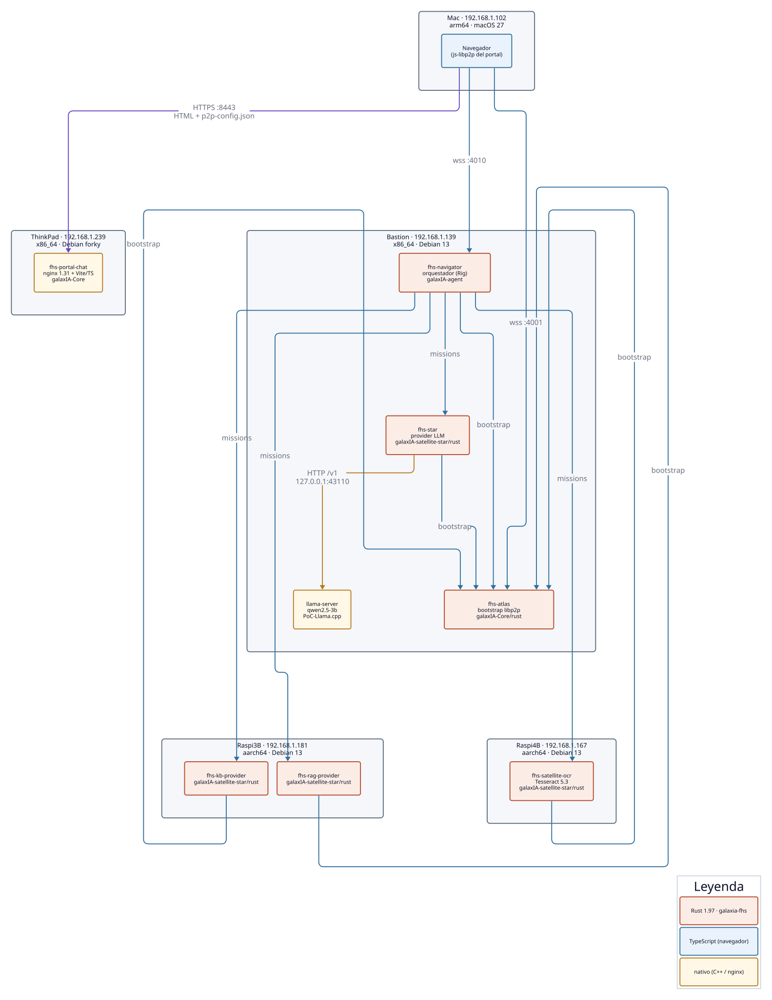

# Mapa de módulos de la PoC

Qué módulos existen, dónde está su código, qué hace cada uno, en qué
lenguaje y versión están, qué tan acoplados están y en qué máquina corren
hoy. Datos medidos el **2026-09-27** en las máquinas. Ese mismo día el
backend pasó de TypeScript a Rust (ver `galaxIA/docs/migracion-rust-rendimiento.md`);
los contenedores TS quedaron detenidos como reversa (`*-ts-rollback`).

Complementa a [`arquitectura-poc.md`](arquitectura-poc.md) (cómo fluye un
mensaje) y [`estado-poc.md`](estado-poc.md) (qué versión está desplegada).

## Máquinas (red soberana `192.168.1.0/24`, router OpenWrt `192.168.1.1`)

| Máquina | IP | Arquitectura · SO | Runtime | Módulos |
|---|---|---|---|---|
| Bastion (Mac mini 6,2) | `192.168.1.139` | x86_64 · Debian 13 | podman 5.4.2 rootless | Atlas, Navigator, Star, llama-server |
| Raspi4B | `192.168.1.167` | aarch64 · Debian 13 | podman 5.4.2 root | Satellite OCR |
| Raspi3B «portal-pi» | `192.168.1.181` | aarch64 · Debian 13 | podman 5.4.2 root | KB provider, RAG provider |
| ThinkPad | `192.168.1.239` | x86_64 · Debian forky | podman 5.8.6 rootless | Portal Chat |
| Mac | `192.168.1.102` | arm64 · macOS 27 | — | navegador (cliente) y desarrollo |

## Módulos desplegados

Todos los nodos FHS del backend corren en **Rust 1.97** (edición 2021) con
**rust-libp2p 0.57** sobre el crate compartido `galaxia-fhs`, en imágenes
`debian:bookworm-slim` (OCR suma Tesseract y poppler). El Portal sigue en
TypeScript: el navegador es un nodo **js-libp2p 3.3.8**. Mismo wire, mismas
variables de entorno y mismos volúmenes de identidad que los TS, así que cada
nodo conservó su DID y PeerId.

| Módulo | Repo · ruta | Lenguaje · versión | Responsabilidad | Máquina | Puertos |
|---|---|---|---|---|---|
| **Atlas** (`fhs-atlas`) | `galaxIA-Core` · `rust/atlas` | Rust · `galaxia-atlas` 0.1.0 | Bootstrap de la red libp2p: punto de entrada, DHT (servidor), reenvío GossipSub de todos los temas y de los anuncios vigentes a cada suscriptor nuevo, mDNS. No enruta misiones. | Bastion `.139` | P2P `4001` · API `8081` |
| **Navigator** (`fhs-navigator`) | `galaxIA-agent` (raíz) | Rust · `galaxia-agent` 0.1.0 · Rig 0.42 | Orquestador: sesión del Portal, elección de LLM, subasta de misiones (offer/bid/assign), OCR determinista, RAG por red, recomendación y consulta de KB, prompt, tool calling y procedencia. | Bastion `.139` | P2P `4010` · API `8090` |
| **Portal Chat** (`fhs-portal-chat`) | `galaxIA-Core` · `apps/portal-chat` | TS (Vite) servido por nginx 1.31 · `@rafex/galaxia-portal-chat` 0.1.21 | Interfaz web. El navegador es un nodo js-libp2p: se conecta a Atlas y a Navigator. RAG local en el navegador (MiniLM + sqlite-wasm), panel de diagnóstico, Markdown. | ThinkPad `.239` | HTTPS `8443` |
| **Star** (`fhs-star`) | `galaxIA-satellite-star` · `rust/star` | Rust · `galaxia-star` 0.1.0 | Provider LLM: puja por misiones `chat`, recibe el stream directo y reenvía la respuesta de llama-server en vivo. | Bastion `.139` | P2P `4002` |
| **llama-server** | `PoC-Llama.cpp` (compila `ggml-org/llama.cpp` `7fe450e`) | C++ · binario en `/opt/llama.cpp` · perfil `apple/macmini6.2` (AVX+F16C) | Inferencia local del modelo (qwen2.5-3b-instruct Q4_K_M) con API OpenAI-compatible. | Bastion `.139` (`systemd --user`) | HTTP `43110` (solo local) |
| **Satellite OCR** (`fhs-satellite-ocr`) | `galaxIA-satellite-star` · `rust/ocr` | Rust · `galaxia-ocr` 0.1.0 · Tesseract 5.3 (`spa`) · poppler | Extrae texto de PDF/imagen (`document.ocr`). | Raspi4B `.167` | P2P `4003` |
| **KB provider** (`fhs-kb-provider`) | `galaxIA-satellite-star` · `rust/kb` | Rust · `galaxia-kb` 0.1.0 | Base de conocimiento estática (`knowledge.query`; hoy, texto de ejemplo de la Constitución). | Raspi3B `.181` | P2P `4006` |
| **RAG provider** (`fhs-rag-provider`) | `galaxIA-satellite-star` · `rust/rag` | Rust · `galaxia-rag` 0.1.0 | Indexa y recupera fragmentos por conversación (`document.index`, `document.query`); también fusiona resultados de KB. | Raspi3B `.181` | P2P `4005` |

## Librerías compartidas (acoplamiento en compilación, no en ejecución)

| Librería | Repo · ruta | Lenguaje · versión | La usan | Qué aporta |
|---|---|---|---|---|
| IDL FHS | `galaxIA` · `idl/fhs-protocol.proto` | Protobuf 3 | todos (vía SDK) | Contrato del wire: Envelope, mensajes GossipSub, misiones |
| `@rafex/galaxia-fhs-protocol` | `galaxIA-SDK` · `packages/fhs-protocol` | TS 5.9 · 0.1.36 en npmjs (`@rafex_labs/…`) | Portal (y los nodos TS de reversa) | Tipos generados, codificación Protobuf, cadenas de firma |
| `galaxia-fhs` | `galaxIA-SDK` · `rust/fhs` | Rust 1.97 · 0.1.0 (git) | Navigator, Star, OCR, KB, RAG, Atlas | IDL generado (copia verificada por sha256), firmas, identidad, TLS con pin, nodo libp2p por papel, misiones del lado Navigator y del lado provider |
| `galaxia-provider-kit` | `galaxIA-satellite-star` · `rust/kit` | Rust 1.97 · 0.1.0 | Star, OCR, KB, RAG | Configuración por env, arranque y apagado, motor de solapamiento de KB/RAG, ciclo común de tools |
| Perfiles de parseo | `galaxia-parser-catalog` | TS + JSON + SQLite · 0.1.0 | Star TS (copia local en `parser-profiles.ts`); el Star Rust no lo usa: solo aplicaba a respuestas sin streaming | Parseo tolerante de tool calls escritas como texto |

## No desplegados

| Módulo | Repo · ruta | Lenguaje · versión | Estado |
|---|---|---|---|
| **Nodos TS anteriores** | `galaxIA-Core/apps/{atlas,navigator}`, `galaxIA-satellite-star/examples/*` | TS · Node 24 | Reemplazados por Rust el 2026-09-27; contenedores detenidos como reversa. `@rafex/galaxia-fhs-protocol` sigue en uso por el Portal. |
| **Nova** | `galaxIA-satellite-star` · `examples/nova-example` | TS · 0.2.0 | Nodo de razonamiento con loop propio (SPEC-NOVA-0001). Sin contenedor en la PoC. |
| **Portal TUI** | `galaxIA-Core` · `apps/portal-tui` | TS · 0.1.0 | Esqueleto de cliente de terminal; sin implementar. |
| **log-agent** | `galaxIA-Core` · `apps/log-agent` | TS · 0.1.0 | Colector central de logs vía NATS (DEC-0083). Fuera del protocolo; no hay NATS en la PoC. |
| **satellite-web** | `galaxIA-SDK` · `apps/satellite-web` | TS + Rust→WASM (`satellite-capabilities-wasm` 0.1.4, edición 2021) | Demo de Ephemeral Satellite (aritmética y CURP en un Web Worker). |
| Túnel para demos | `galaxIA-gitops` · `rathole/`, `certbot/` | TOML + Bash | Diseñado, no desplegado (faltan subdominio y VPS). |
| Laboratorio E2E | `galaxIA-E2E` (privado) | Bash | Orquestación de la prueba de punta a punta. |

## Acoplamiento: ¿se pueden instalar en máquinas distintas?

**Sí, todos los nodos FHS son independientes.** Hablan solo por libp2p
(GossipSub + streams directos), así que Atlas, Navigator, Star, OCR, KB y
RAG pueden correr cada uno en otra máquina sin tocar código. Lo que sí los
ata:

| Acoplamiento | Tipo | Qué implica al moverlos |
|---|---|---|
| Todos → **Atlas** | Configuración (`FHS_BOOTSTRAP_ADDRS` con IP y PeerID) | Atlas es el único bootstrap: si cambia de máquina o IP hay que actualizar la variable en cada nodo y en el `p2p-config.json` del Portal. Su PeerID se conserva con el volumen `atlas-data`. |
| **Star → llama-server** | HTTP (`LLAMA_CPP_URL`, hoy `127.0.0.1:43110`) | Único acoplamiento fuera de libp2p. Pueden ir en máquinas distintas cambiando la URL, pero conviene juntarlos: el prompt y cada token viajarían por la red. |
| **Navegador → Navigator** | libp2p directo (`wss://…:4010`) | El navegador marca a Navigator por sí mismo: Navigator debe ser alcanzable desde la red del usuario y con un certificado que el navegador acepte. |
| **Portal → Atlas** | Configuración (`p2p-config.json`) | El Portal solo sirve archivos estáticos: puede ir en cualquier máquina (hoy la ThinkPad). |
| **Certificado TLS** | Despliegue (SAN con las IPs) | El certificado unificado lista `.139`, `.167` y `.181` (y las IPs Netup de Bastion). Mover un nodo P2P a una IP nueva exige regenerarlo; de ahí las reservas DHCP fijas. |
| **Identidades** | Volúmenes (`atlas-data`, `navigator-data`, `star-data`, `ocr-data`, `kb-data`, `rag-data`) | Mover un nodo sin su volumen le cambia DID/PeerID; el volumen debe viajar con el contenedor. |
| **Navigator → IPFS** | Opcional (`IPFS_API_URL`) | Solo para adjuntos por IPFS; sin configurar, los adjuntos van inline. |
| Librerías compartidas | Compilación | Actualizar `fhs-protocol` obliga a recompilar las imágenes; no crea dependencia entre máquinas. |

Recomendaciones de ubicación con el hardware actual:

- **Juntos:** Star y llama-server (latencia del streaming).
- **Donde haya RAM:** Star + llama-server (el modelo 3B usa ~2 GB).
- **Donde sea:** OCR, KB y RAG (poca RAM; Raspis).
- **Alcanzable desde los usuarios:** Atlas (`4001`) y Navigator (`4010`),
  que el navegador marca directo; es lo que expone el túnel de la demo
  remota.
- **Punto único de falla hoy:** Bastion (Atlas + Navigator + Star + LLM).
  Separar Atlas en otra máquina es el primer paso si se quiere tolerancia.
