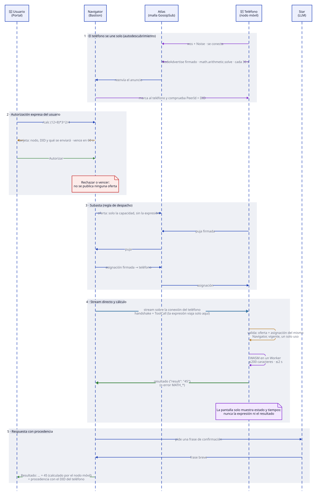

# Nodo móvil de aritmética (`/calc`) — despliegue y demo

Un teléfono abre una página servida desde la ThinkPad, se une a la red como Satellite y ofrece
`math.arithmetic.solve`. Desde el Portal, `/calc <expresión>` pide **autorización expresa**, y el
Navigator despacha con **oferta → puja → asignación → stream** (regla DEC-0096, ver
`galaxIA/docs/mission.md`). Decisión: DEC-0097.




## Contenedores

| Host | Contenedor | Imagen | Puerto | Notas |
|---|---|---|---|---|
| ThinkPad | `fhs-portal-chat` | `galaxia-portal-chat:<commit>` | 8443 | Sin cambios; la tarjeta de autorización viene en `cd60a58` o posterior |
| ThinkPad | `fhs-satellite-web` | `galaxia-satellite-web:<tag>` | 8444 | Página del nodo móvil; independiente del Portal |
| Bastion | `fhs-navigator` | `galaxia-agent:<commit>` | 4010 | Con `FHS_COMMAND_NODES` y `FHS_ANNOUNCE_ADDRS` |

## Build

Agente (Bastion; el SDK aún sin publicar se usa como dependencia de ruta):

```bash
# desde el Mac: copiar fuentes y construir en Bastion
podman build -t galaxia-agent:<commit> .   # ver Dockerfile (parche de galaxia-fhs por ruta)
```

Página del nodo móvil (ThinkPad, contexto = raíz de `galaxIA-SDK`):

```bash
podman build -f containers/satellite-web/Containerfile -t galaxia-satellite-web:<tag> .
```

## Arranque

Página (ThinkPad). El certificado debe cubrir la IP desde la que el teléfono abre la página:

```bash
mkdir -p ~/certs/satellite-web
podman run -d --name fhs-satellite-web --restart always -p 8444:443 \
  -v ~/certs/satellite-web:/etc/nginx/certs \
  -e SATELLITE_CERT_CN=192.168.1.239 \
  -e SATELLITE_CERT_SAN=DNS:localhost,IP:127.0.0.1,IP:192.168.1.239 \
  -e FHS_BOOTSTRAP_ADDRS=/ip4/192.168.1.139/tcp/4001/tls/ws/p2p/12D3KooWL2kvLw4MgPbTTpgKBMsHfVjnpp26AVL54VwWkantYHoL \
  localhost/galaxia-satellite-web:<tag>
```

Navigator (Bastion): `scripts/calc/deploy-navigator.sh <commit> [DID,...]`. Por defecto usa
`FHS_COMMAND_NODES=*` (autodescubrimiento: cualquier nodo cuyo anuncio firmado declare comandos del registro); con una
lista de DIDs solo esos pueden ganar. El DID aparece en la página del teléfono (botón "Copiar").
El script deja la reversa `fhs-navigator-pre-<commit>` (detenida, sin reinicio automático).

La página del teléfono muestra el resumen de misiones, una tabla por misión (estado, respuesta,
cómputo) y los recursos del dispositivo, **sin la expresión ni el resultado**.

Firewall (lo aplica el dueño; requiere sudo): `sudo ufw allow from 192.168.1.0/24 to any port 8444 proto tcp`.

## Teléfono

1. Wi-Fi de `192.168.1.0/24`.
2. Abrir y aceptar el certificado de `https://192.168.1.139:4001/` y de `https://192.168.1.139:4010/`
   (Atlas y Navigator). Sin esto el navegador no puede abrir los WebSocket seguros.
3. Abrir `https://192.168.1.239:8444/`, aceptar el certificado y pulsar **Unirme a la red**.
   Mantener la pantalla encendida y la pestaña visible.

## Guion de demo (≈ 2 min)

1. Teléfono: "Unirme a la red" → "✓ red · ✓ Navigator".
2. Portal: `/calc (12+8)*3^2/4` → tarjeta de autorización (SPEC-AUTH-0001) → **Autorizar lo seleccionado**.
   El teléfono muestra "puja enviada", "asignada" y la expresión; el chat muestra `Resultado: … = 45`
   y la procedencia con el DID del teléfono.
3. `/calc 1/0` → autorizar → "División por cero".
4. `/calc 2+2` → **Rechazar** → no se publica ninguna oferta y el teléfono no muestra actividad.
5. Cerrar la pestaña: en ≤ 60 s el Navigator deja de ver la capacidad.

## Comprobaciones

- El anuncio del Navigator debe traer `/ip4/192.168.1.139/tcp/4010/tls/ws` (no `0.0.0.0`).
- `curl -sk https://192.168.1.239:8444/p2p-config.json` devuelve el bootstrap.
- Con una lista en `FHS_COMMAND_NODES`, un nodo que no esté en ella no registra comandos ni gana, aunque puje.

## Comandos autodescubiertos (SPEC-CMD-0001, DEC-0100)

El Navigator no tiene ningún comando cableado. El teléfono declara `/calc` en el `Beacon.commands`
de su anuncio firmado (nombre, argumentos tipados, forma del resultado); el Navigator lo admite si
la capacidad está en el registro cerrado (`idl/command-capabilities.json`) y el operador lo permite
(`FHS_COMMAND_NODES`; las capacidades `trusted` exigen además `FHS_TRUSTED_NODES`).

- `/ayuda` (local, sin red) lista los comandos vigentes y los conflictos.
- Un `/nombre` que ningún nodo ofrece ahora (p. ej. `/leer`) se responde localmente y **no llega al
  LLM**. `//texto` envía el literal `/texto` al modelo.
- El Portal autocompleta al escribir `/` con la lista que informa el Navigator (`commands.available`).
- Variables: `FHS_COMMAND_NODES` (`*` o DIDs; vacío = sin comandos abiertos), `FHS_COMMAND_REGISTRY`
  (ruta de un registro alterno; si no valida, el Navigator no arranca), `FHS_TRUSTED_NODES`.
- Orden de despliegue (la spec): SDK/IDL → Atlas → Navigator → nodo móvil → Portal.

## Autorización por uso (SPEC-AUTH-0001, DEC-0099)

Todo contenido que sale del Navigator (OCR, IPFS, RAG, KB, comandos y herramientas pedidas por
el LLM) pasa por una tarjeta de autorización: un ítem por envío, de un solo uso, ligado al
digest de los bytes y al nodo exacto, con vencimiento de 60 s. Solo el mensaje literal al Star
elegido es implícito. Variables del Navigator:

- `FHS_TRUSTED_NODES`: DIDs verificados por el operador (nivel `operator` en la tarjeta).
- `AUTH_AUDIT_PATH` (por defecto `/data/authorization-audit.log`): bitácora JSONL sin contenido.
- `FHS_AUTH_POLICY=allow-synthetic|deny`: solo sin interfaz (sondas y pruebas con datos sintéticos).

El Navigator TypeScript (`galaxIA-Core/apps/navigator`) **no es conforme**: tiene OCR, IPFS, RAG,
KB y herramientas desactivados. El de referencia es `galaxia-agent` (Rust).

## Limitaciones conocidas (seguimiento)

- `provider::serve` del SDK Rust no exige asignación (el nodo móvil sí).
- Las firmas FHS no cubren `multiaddrs`, `trust_level` ni las capacidades de la oferta; sin anti-replay.
